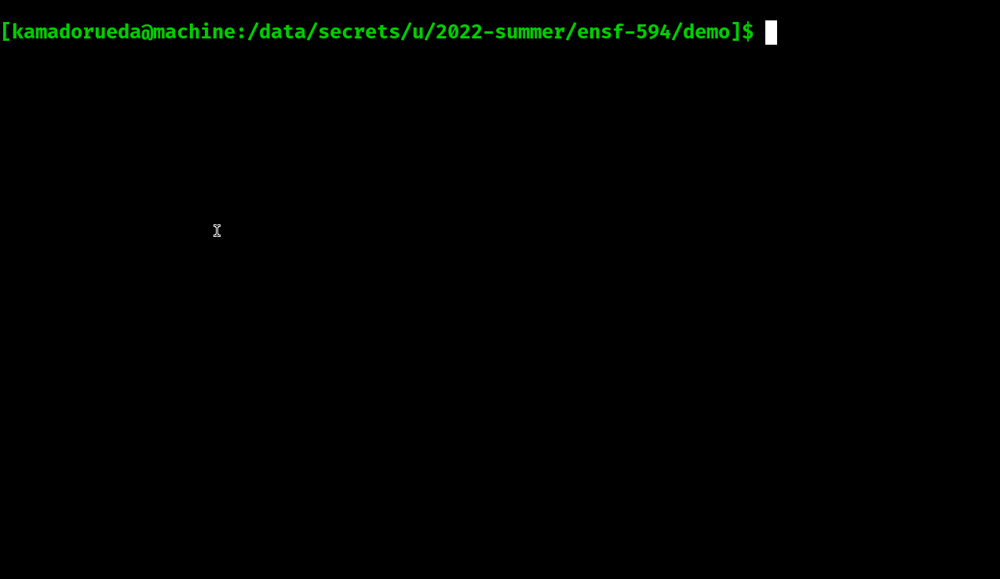

# Maven Java project with JMH

This project contains:

- [Code](./src/main/java/com/username/Code.java):
  A class with methods that perform addition and multiplication.

  You can change those methods to do sorting, searching, or anything you need.

- [Bench](./src/main/java/com/username/Bench.java):
  JMH Benchmarks to measure code performance.

- [App](./src/main/java/com/username/App.java):
  A command line application that can be called with arguments.

- [CodeTest](./test/main/java/com/username/CodeTest.java):
  Tests for the `Code` class.

# Getting started

Just clone this project:

```sh
$ git clone https://github.com/kamadorueda/maven-project-example
```

Now enter the repository:

```sh
$ cd maven-project-example
```

Run the Benchmarks:

```sh
$ mvn clean package
$ java -jar target/Bench.jar
```

Run the App, with arguments "x y z":

```sh
$ mvn clean package
$ java -jar target/App.jar x y z

  Hello world!
  String[] args = [x, y, z]
  method1(2, 3) = 5
  method2(2, 3) = 6
```

Run the tests:

```sh
$ mvn clean test
```

In a video:


